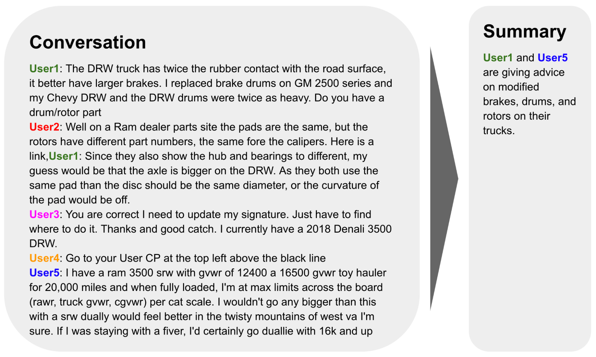

# Problem Description

This project aims to develop a system capable of automatically **summarizing short dialogue text**. This addresses the challenge of extracting concise yet informative summaries from conversational exchanges, enabling users to **quickly grasp the information of the dialogues**.

Summarizing these conversations can be valuable for various applications, such as:
- Streamlining information retrieval in customer service interactions
- Condensing meeting discussions for efficient review
- Providing concise overviews of chat conversations on social media platforms

This project tackles the task of automatically generating concise summaries, saving users time and effort while improving comprehension.



<p align="center"><i>Source: Google Research</i></p>

**Input:** Dialogue text

Example: 
```
Matt: Do you want to go for date? 
Agnes: Wow! You caught me out with this question Matt. 
...
Agnes: See you on saturday. 
Matt: Yes, looking forward to it. 
Agnes: Me too.
```

**Output:** Summarized dialogue

Example: 
```
Matt invites Agnes for a date to get to know each other better. They'll go to the Georgian restaurant in Kazimierz on Saturday at 6 pm, and he'll pick her up on the way to the place.
```

# Dataset

We'll utilize the `DialogSum` dataset accessible from 🤗**Hugging Face** (https://huggingface.co/datasets/knkarthick/dialogsum) and **Paper** (https://arxiv.org/pdf/2105.06762.pdf). This dataset comprises real-life dialogue scenarios paired with corresponding manually crafted summaries and dialogue topics.

`DialogSum` is a large-scale dialogue summarization dataset, consisting of **13,460** (Plus 100 holdout data for topic generation) dialogues with corresponding manually labeled summaries and topics.

Here's a sample of the `DialogSum` dataset structure:


|id|dialogue|summary|topic|
|-|-|-|-|
|train_3|#Person1#: Why didn't you tell me you had a girlfriend? #Person2#: Sorry, I thought you knew. ... #Person1#: Oh, you men! You are all the same.|#Person1#'s angry because #Person2# didn't tell #Person1# that #Person2# had a girlfriend and would marry her.|have a girl friend|
|train_16|#Person1#: Tell me something about your Valentine's Day. ...#Person2#: Yeah, that is what the holiday is for, isn't it?|#Person2# tells #Person1# their Valentine's Day. #Person1# feels it's romantic.|Valentine's Day|
|...|...|...|...|

# Method

### Pre-trained Language Models:

This project explores two powerful LLMs well-suited for dialogue summarization:

- **FLAN-T5:** This model excels at understanding complex relationships within text, making it effective in summarizing the nuances of conversations.
- **BART:** This model boasts strong capabilities in text generation tasks, making it adept at generating informative and well-structured summaries.

### Fine-tuning Techniques:

To tailor these LLMs specifically for dialogue summarization, we will investigate several fine-tuning approaches:

- Instruction Fine-tuning
- Parameter Efficient Fine Tuning (PEFT)
    + Low-Rank Adaptation **(LoRA)**
    + Quantized Low-Rank Adaptation **(QLoRA)**

# Installation

```
!git clone "https://github.com/dtruong46me/dialogue-text-summarization.git"
```

# Contributions

**Supervisor:** Prof. Le Thanh Huong

**Student Group:**

|No.|Name|Student ID|Email|
|:-:|-|:-:|-|
|1|Phan Dinh Truong (Leader)|20214937|truong.pd214937@sis.hust.edu.vn|
|2|Nguyen Tung Luong|20214913|luong.nt214913@sis.hust.edu.vn|
|3|Vu Tuan Minh|20210597|minh.vt210597@sis.hust.edu.vn|
|4|Hoang Tu Quyen|20214929|quyen.ht214929@sis.hust.edu.vn|

# [Bonus] How to run Streamlit on Kaggle

```
!pip install -q streamlit
```

```
!wget -q -O - ipv4.icanhazip.com
```

```
!npm install -g localtunnel -q
```

```
!streamlit run "/kaggle/working/dialogue-text-summarization/streamlit_app.py" & npx localtunnel --port 8501
```